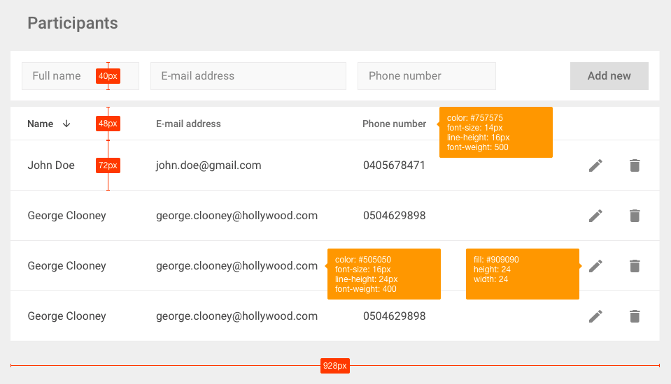

# HTML5 test

This is a preliminary test to determine the technical ability of developers
applying for front-end positions at Nord Software.

Before starting, please read carefully through the instructions below. You are
free to look up any information online and offline and spend as much time on
the test as you deem necessary. Please direct any questions to Eric Nishio at
eric@nordsoftware.com.

Your task is to create a small signup form and a list of participants with
[React](https://facebook.github.io/react/) that meets the following
requirements:

- Use [Create React App](https://github.com/facebookincubator/create-react-app) to scaffold your application
- Generate 20 participants that contain randomized values for the following properties: **id**, **name**, **email address**, and **phone number**
- Render a table that displays the participants on individual rows
- Create a form for adding new participants to the table (remember to validate the form)
- Make each participant editable by clicking on a table cell (inline editing)
- Add support for deleting rows
- Make each column sortable upon clicking on a column header
- Write a developer-friendly installation guide
- Deploy a live build on the internet
- **[Follow the design](https://marvelapp.com/2bda7h0/screen/25314120) as accurately as possible**

Sizes and colors:

Upon completing the test, please push your code to a new public repository on [GitHub](https://github.com), and email the link to eric@nordsoftware.com.

Good luck!
